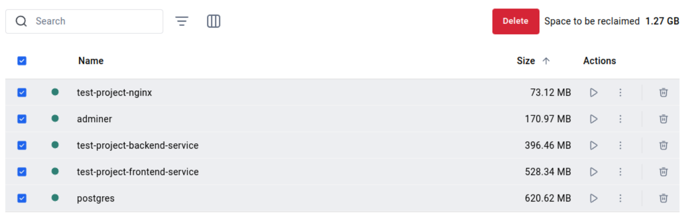
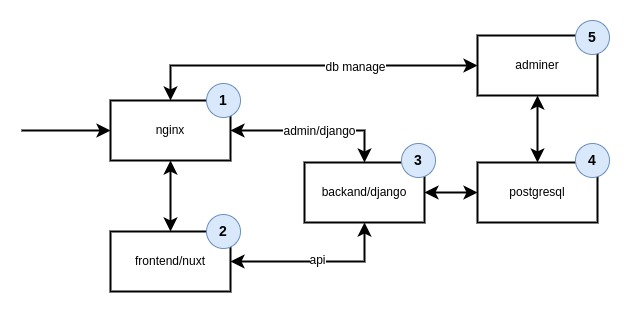
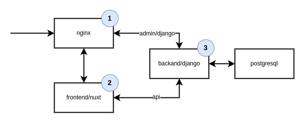

# Общая информация
## Используемые прораммы и frameworks
1. Docker ([Docker](https://www.docker.com/))
2. Nginx ([Nginx](https://nginx.org/ru/))
3. Django DRF ([Django](https://www.djangoproject.com/))
4. PostgreSQL ([PostgreSQL](https://www.postgresql.org/))
5. Nuxt ([Nuxt](https://nuxt.com/))
6. Adminer ([Adminer](https://www.adminer.org/))

## Итоговый размер images


## Dev


Для запуска (пересобрать images)
```
docker compose -f docker-compose-dev.yaml up --build
``` 
или
```
docker compose -f docker-compose-dev.yaml up
```

В `dev` окружении используется пять (5) контейнеров

## Prod

```
docker compose -f docker-compose-prod.yaml up --build
```
или
```
docker compose -f docker-compose-prod.yaml up
```
В `prod` окружении используется четыре (4) контейнера

## Полезные команды

ruff это аналог autopep8. Подробнее можно ознакомиться на сайте с официальной документацией https://docs.astral.sh/ruff/
```
cd backend
pipenv run ruff format backend/
```
или
```
cd backend
pipenv run ruff check backend/ --fix
```

